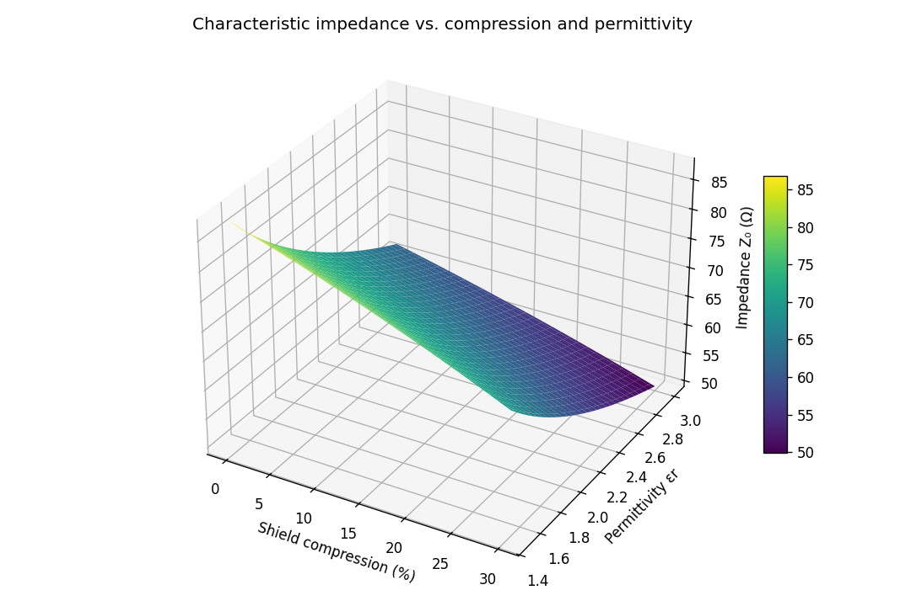
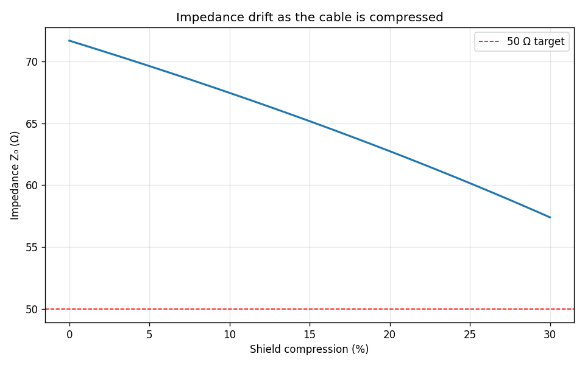
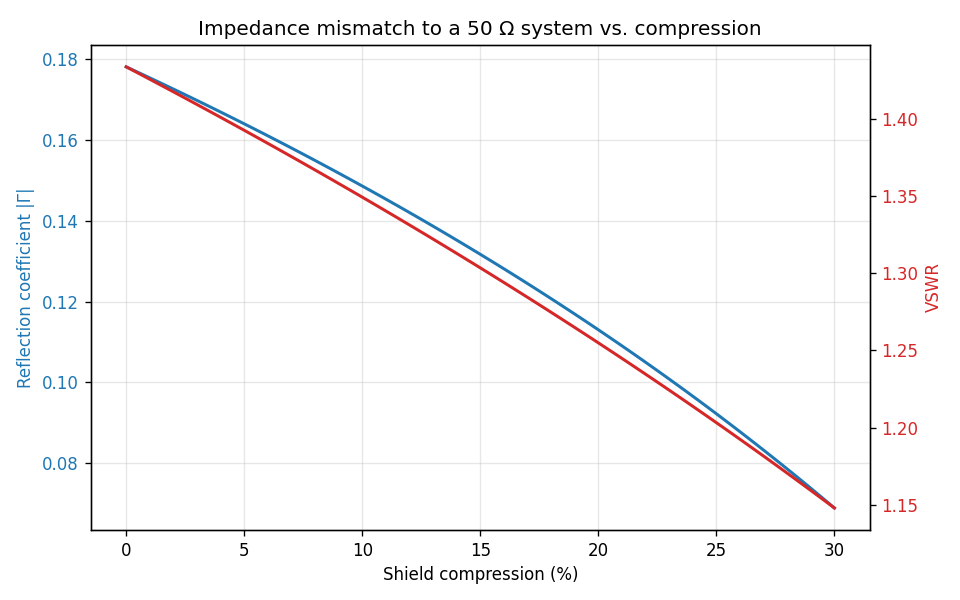

# Coaxial Cable Impedance Under Deformation

Model of how a **coaxial cable's characteristic impedance shifts when the cable
is mechanically deformed**. The characteristic impedance depends on the ratio of
shield to core radius and on the dielectric permittivity:

```
Z0 = (60 / sqrt(eps_r)) * ln(b / a)
```

When the cable is compressed, the effective shield radius `b` shrinks, lowering
`b/a` and pulling `Z0` away from its nominal value — which creates an impedance
mismatch and signal reflections in the transmission line.

---

## Overview

- **Impedance model** — `Z0` as a function of core radius, shield radius, and
  permittivity.
- **Deformation** — impedance as the shield is compressed by a given fraction.
- **Mismatch analysis** — reflection coefficient `|Γ|` and VSWR against a 50 Ω
  system as deformation increases.

---

## Results

Characteristic impedance as a joint function of shield compression and dielectric
permittivity:



Impedance drift as the cable is progressively compressed:



Resulting impedance mismatch to a 50 Ω system — reflection coefficient and VSWR
both grow as the deformation worsens:



For the modeled geometry, a 20% shield compression shifts `Z0` from ~71.7 Ω to
~62.7 Ω, raising the VSWR to ~1.26.

---

## Repository structure

```
coaxial-cable-impedance/
├── cable/
│   └── impedance.py   # Z0, compression model, reflection coefficient, VSWR
├── main.py            # demo: impedance surface, drift, mismatch; writes assets/
├── assets/            # generated figures
├── requirements.txt
└── LICENSE
```

---

## Getting started

```bash
pip install -r requirements.txt
python main.py
```

Programmatic use:

```python
from cable.impedance import CoaxGeometry, impedance_under_compression, vswr

geom = CoaxGeometry(core_radius_m=0.5e-3, shield_radius_m=3.0e-3, eps_r=2.25)
z = impedance_under_compression(geom, compression_frac=0.2)
print(z, vswr(z, z_ref=50.0))
```

---

## Notes

Dependency-light (NumPy + Matplotlib). The model uses the standard low-loss
coaxial impedance formula; deformation is modeled as a uniform reduction of the
shield radius. Geometry and permittivity are grouped in `CoaxGeometry` for easy
adaptation to a specific cable.

---

## License

Released under the MIT License — see [LICENSE](LICENSE).
